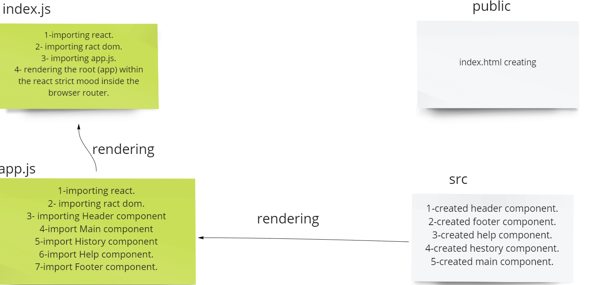

# RESTY

# description
created a RESTful API application for making a crud operation.
# steps
1. created a react app in the resty repo file.
2. created a file named index.js and within it  imported the App.js to be rendered,Also added the route  react feature.
3. created a file named App.js and imported the (Header ,Main , History , Help, Footer components) and rendering the components Header , Main,History,Help.

4. created a components folder and created the following components (functional components):
Header.js
Main.js
History.js
Help.js
Footer.js
4. whithin each component i created a div and rendered the component's data.
5.created scss files for the styling of the components.
5. added a proxy to the react app.

# UML

# Links
- [PR](https://github.com/ibrahimalaqoul/resty/pull/3)
- [NETLIFY](https://62763c410a26a10009d6ae77--cosmic-lebkuchen-0225dd.netlify.app/)
